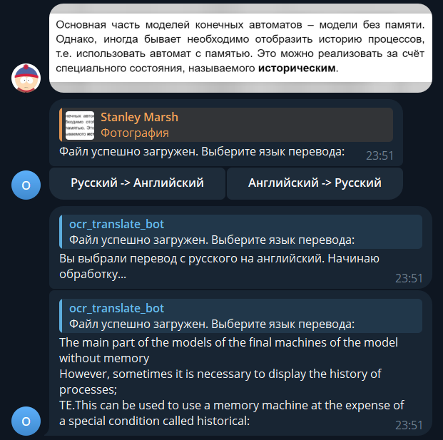
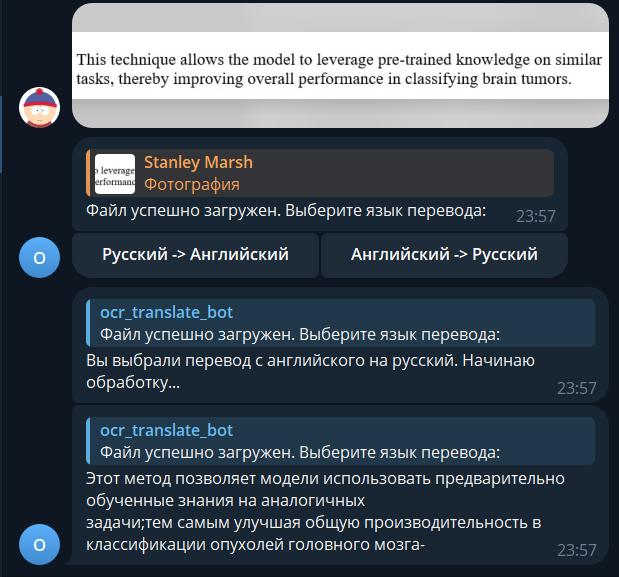

# OCRTranslationBot

Этот проект представляет собой Telegram-бота, который позволяет пользователям загружать изображения с текстом, распознавать этот текст с помощью OCR (Optical Character Recognition), а затем переводить распознанный текст на выбранный язык (поддерживается русский->английский и английский->русский).

## Основные функции бота:
- Распознавание текста на изображении с использованием библиотеки EasyOCR.
- Перевод распознанного текста на указанный пользователем язык с помощью Google Translate API через библиотеку googletrans.
- Отправка результата перевода обратно пользователю в виде сообщения в Telegram.

## Используемые технологии и библиотеки:
- Aiogram – асинхронная библиотека для создания Telegram-ботов.
- EasyOCR – библиотека для оптического распознавания символов (OCR).
- GoogleTrans – обертка для Google Translate API.
- OpenCV – библиотека компьютерного зрения.
- Python-DotEnv – библиотека для работы с файлами .env.

## Примеры
### Пример перевода с русского на английский


### Пример перевода с английского на русский


## Установка и запуск

### Требования к среде:
- Python версии 3.8 или выше.
- Установленные зависимости (см. requirements.txt).

### Шаги установки:
1. Клонируйте репозиторий:

   git clone https://github.com/python-SPbPU/ocr-translation-bot.git
   
   
2. Создайте виртуальное окружение и активируйте его:
   
   python3 -m venv venv
   source venv/bin/activate
   

3. Установите необходимые пакеты:
```commandline
   pip install -r requirements.txt
```

4. Создайте файл .env и добавьте туда следующие переменные окружения:
```
   # Ваш токен от Telegram-бота
   TELEGRAM_BOT_TOKEN=<ваш_токен>
```

5. Запустите бота:
```commandline
    python main.py
```   

Теперь бот готов принимать запросы пользователей!

## Как использовать бота?
1. Найдите бота в Telegram по его имени или ID.
2. Начните чат с ботом командой /start.
3. Загрузите изображение с текстом, которое хотите распознать и перевести.
4. Выберите язык, на который нужно перевести текст.
5. Бот обработает ваше изображение, переведет текст и отправит результат вам в сообщении.

## Лицензия
Этот проект распространяется под лицензией MIT License. Вы можете свободно использовать, изменять и распространять код при условии указания авторства и соблюдения условий лицензии.
